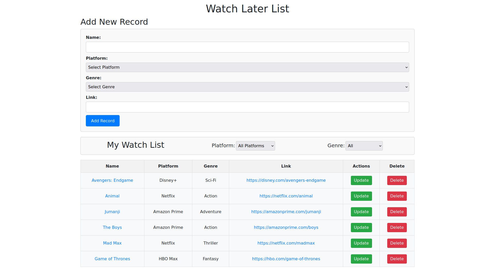

# Watch-Later-List
The project assignment to maintain Things like Movies, TV Series in a Watch Later list. This assignment is a part of recuritment process for Stagewise

## Technology Used
**Frontend:**
- React
- Bootstrap
- Css

**Backend:**
- Node.js
- Express.js

## Setup

Make sure to have MongoDB installed on your system.

### There are 2 Folders:
> watch-later-list-backend

> watch-later-list-frontend

Make sure to Install all dependencies in both.
use `npm install`

## Usage

- Open Terminal **cd** into backend folder and run:
`node app.js`

- Open another terminal window and **cd** into frontend folder and run:
`npm start`
